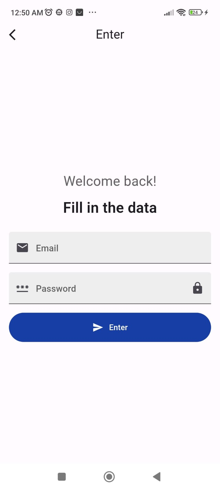
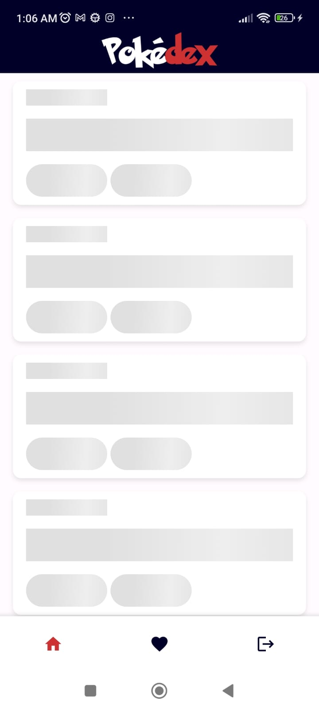
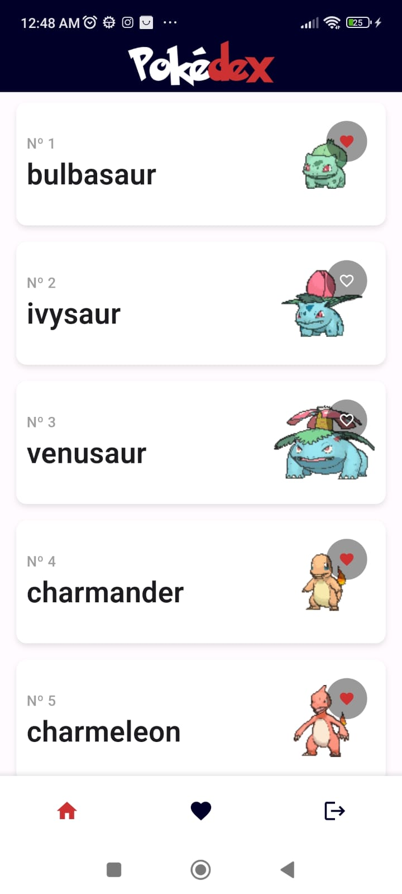
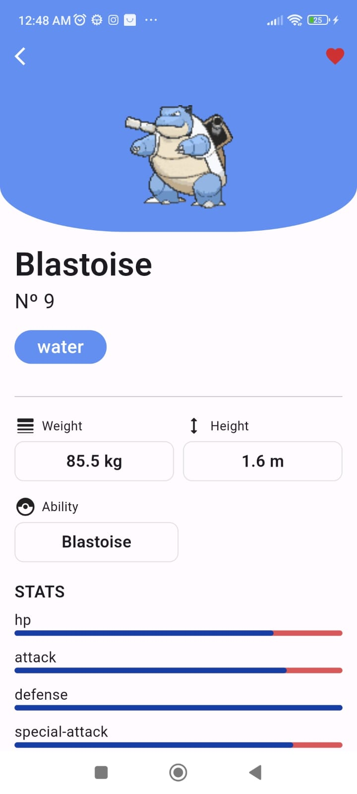
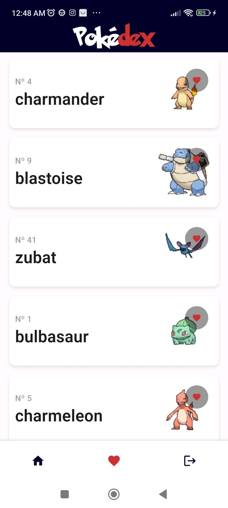
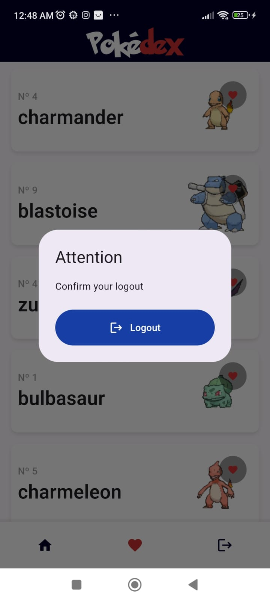

<h1 align="center">Tractian Challenge</h1>

## :iphone: Sobre o projeto

Este app faz parte do [desafio técnico mobile da Conta Azul](https://github.com/dtodt/ca_flutter_test/tree/main), tendo como principais funcionalidades:

- Autenticação por Firebase
- Listagem de pokemons
- Detalhes do pokemon
- Favoritar/desfavotirar pokemons

O app foi projetado seguindo o modelo arquitetural [MiniCore Arch](https://github.com/Flutterando/minicore).

## :camera: Prints

#### Splash

  

#### Login

  
  

#### Home

  
  

#### Pokemon details

  
  

#### Favorites

  

#### Logout

  

## 🎥 Fluxo do aplicativo

<video width="320" height="240" controls>
  <source src="https://github.com/user-attachments/assets/ec172c64-78a7-4857-a89e-773152944fed" type="video/mp4">
</video>

https://github.com/user-attachments/assets/ec172c64-78a7-4857-a89e-773152944fed

## :rocket: Pacotes utilizados

- [Asp](https://pub.dev/packages/asp/versions/1.3.0)
- [flutter Modular](https://pub.dev/packages/flutter_modular/versions/6.3.2)
- [Dio](https://pub.dev/packages/dio/versions/5.5.0+1)
- [Pretty Dio Logger](https://pub.dev/packages/pretty_dio_logger/versions/1.3.1)
- [Firebase Core](https://pub.dev/packages/firebase_core/versions/3.2.0)
- [Firebase Auth](https://pub.dev/packages/firebase_auth/versions/5.1.2)
- [Flutter launcher Icons](https://pub.dev/packages/flutter_launcher_icons/versions/0.13.1)
- [Flutter Native Splash](https://pub.dev/packages/flutter_native_splash/versions/2.4.0)
- [Cached Network Image](https://pub.dev/packages/cached_network_image/versions/3.3.1)
- [Equatable](https://pub.dev/packages/cached_network_image/versions/2.0.5)
- [Dartz](https://pub.dev/packages/dartz/versions/0.10.1)
- [Shimmer](https://pub.dev/packages/shimmer/versions/3.0.0)
- [Form Builder Validators](https://pub.dev/packages/form_builder_validators/versions/9.1.0)
- [Infinite Scroll Pagination](https://pub.dev/packages/infinite_scroll_pagination/versions/4.0.0)
- [Sqflite](https://pub.dev/packages/sqflite/versions/2.3.2)
- [Shared preferences](https://pub.dev/packages/shared_preferences/versions/2.2.3)
- [Path](https://pub.dev/packages/path/versions/1.8.3)

## :computer: Como executar

```bash
# Clone Repositorio
$ git clone https://github.com/CastroClucas81/ca_flutter_test.git

# Acesse a pasta do desafio
$ cd blue_challenge

# Instale as dependências
$ flutter pub get

# Rode a cobertuda de testes do projeto
flutter test --coverage ./lib/src

# Rode a aplicação
$ flutter run --dart-define-from-file envs/integration.json --flavor integration
```

## :page_facing_up: Licença

This project is under the [MIT License](./LICENSE)

Made by Lucas Cardoso de Castro.
